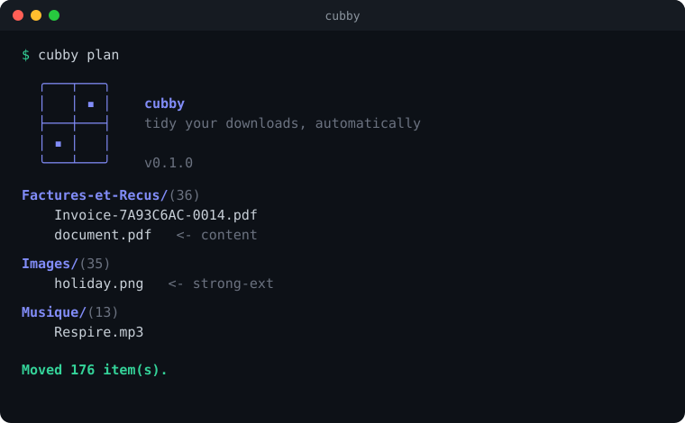

<p align="center">
  
</p>

<p align="center">
  <a href="https://github.com/DeharengOlivier/cubby/actions/workflows/ci.yml"></a>
  <a href="LICENSE"></a>
  <a href="https://www.python.org"></a>
</p>

<p align="center"><em>Tidy your Downloads folder automatically. Every file finds its cubby.</em></p>

<p align="center">
  
</p>

# Cubby

Cubby is a small, dependency-light CLI that watches a folder (your `~/Downloads`
by default) and files each new download into the right place using a
**three-stage cascade**:

1. **Filename** - fast and precise (`Invoice-2026.pdf` is obviously an invoice).
2. **Content** - when the name says nothing (`3c0fe3ad-....pdf`), cubby peeks
   inside and reads the text.
3. **File type** - a last-resort fallback by extension (`.png` -> Images).

Anything it cannot confidently place lands in a single `_Unsorted` folder, so
your root stays clean and nothing is ever lost.

```
~/Downloads/
├── Invoices/
├── Bank-Statements/
├── Legal/
├── Resumes/
├── Travel/
├── Images/
├── Music/
├── Installers/
└── _Unsorted/
```

## Install

```sh
git clone https://github.com/DeharengOlivier/cubby.git
cd cubby
./install.sh            # CLI only
./install.sh --service  # CLI + background agent (auto-starts at login)
```

The installer uses [pipx](https://pipx.pypa.io) when available, otherwise a
self-contained virtualenv. Requires Python 3.11+. Works on macOS (launchd) and
Linux (systemd).

## Use

```sh
cubby init        # write a starter config to ~/.config/cubby/config.toml
cubby plan        # preview where everything would go (moves nothing)
cubby explain F   # where would file F go, and which rule decides? (moves nothing)
cubby run         # sort the folder once
cubby history     # recent runs, their counts, which were undone
cubby log --warnings   # what the agent logged; --run ID for one pass
cubby undo        # revert the last run (or --run ID from history)
cubby watch       # keep sorting in the foreground (Ctrl-C to stop)
cubby install     # register the background agent (sorts every minute)
cubby uninstall   # remove the agent
cubby pause       # stop the agent moving files (--for 2h), without uninstalling
cubby resume      # let it sort again
cubby status      # is the agent really running? paused? when did it last pass? what failed?
cubby doctor      # show environment and content-extraction support (--notify to test alerts)
```

Everything is configurable on the command line:

```sh
cubby run --source ~/Desktop --delay 30s --no-content
cubby install --delay 2m --interval 1m
```

By default a file is only moved once it has sat still for **1 minute** (`--delay`),
so in-progress downloads are never grabbed mid-write.

## Invoices, filed by month and renamed

Categories flagged with `date_folders` (the shipped `Invoices` and
`Bank-Statements`) file each document into a **month/year subfolder** taken from
the date printed on the document, else a date in its file name
(`Invoice-2026-08-spotify.pdf`), falling back to the download date when neither
is readable. Invoices additionally get a clean name, `<vendor> facture <date>`,
with no date when it would only be the download date (`spotify facture.pdf`):

```
Invoices/
  2026-07/
    spotify facture 2026-07-07.pdf
  2026-06/
    ovh facture 2026-06-30.pdf
```

It reads dates and vendors in **French and English**. Pick the folder style on
the command line:

```sh
cubby run --month-style numeric          # 2026-07 (default)
cubby run --month-style letters          # juillet 2026
cubby run --month-style letters --month-lang en   # July 2026
```

When cubby cannot confidently identify the vendor it keeps the original filename
(it never guesses: generic words such as `invoices`, `your bill` or `scan` are
not a vendor), and `cubby plan` previews every subfolder and rename before
anything moves.

## How it works

For each file, cubby walks a cascade and stops at the first stage that produces
a category:

```
.dmg / .png / .mp4   ──▶  strong extension   (an installer is an installer)
Invoice-2026.pdf     ──▶  filename match
3c0fe3ad-….pdf       ──▶  content match       (reads the text inside)
random.pages         ──▶  type fallback        (by extension)
mystery.qzx          ──▶  _Unsorted
```

Specific categories are tried before broad ones, so `Invoices` wins over the
catch-all `Documents`. See [docs/architecture.md](docs/architecture.md).

## Content extraction

The content stage uses whatever is available and degrades gracefully:

| Format        | Backend (first found wins)        |
|---------------|-----------------------------------|
| PDF           | `pdftotext`, then `pypdf`          |
| docx          | `python-docx`, then `textutil`    |
| doc / rtf     | `textutil` (macOS), `antiword`    |
| html          | `textutil`, then a stdlib stripper |
| xlsx          | `openpyxl`                        |
| txt/md/csv    | read directly                     |

Install the optional extractors with `pip install 'cubby-sort[extract]'`.
Run `cubby doctor` to see what is active.

A converter that is installed and breaks on a file (it times out, crashes,
runs out of memory or exits with an error) does not stop the sort: the next
converter is tried, and when none gives text the file is still routed by its
name and type. That last case is not hidden either: the log gets a WARNING
line naming the file, each converter and how it failed, and `cubby status`
counts those files over the last 24 hours. A file that a later converter
still read is sorted by its content and not reported. A converter that is not
installed is only reported by `cubby doctor`.

Reading is bounded, because cubby runs unattended. A file over 20 MB is not
opened at all (its name and type still route it), each backend reads a window
rather than the whole file, and every external converter runs with a timeout.
Asking for 4 KB of text out of a 315 MB page costs neither time nor memory.

Sorting itself is linear in the number of files, journal included: 0.6 to 0.9 ms
of CPU per file moved (on a busy machine), and nothing once the folder is sorted.

| Files | Apply (CPU, median) | Idle pass | Memory of the agent's pass |
| ---: | ---: | ---: | ---: |
| 1 000 | 0.7 s | 0.00 s | under 1 MB |
| 20 000 | 11 to 15 s | 0.00 s | 4 MB |
| 200 000 | 180 s | 0.01 s | 26 MB |
| 400 000 | 337 s | 0.01 s | 54 MB |

Measured, not estimated (method, limits and next steps in
[docs/PERFORMANCE.md](docs/PERFORMANCE.md)), and re-runnable on your own hardware:

```bash
python benchmarks/bench_sort.py
python benchmarks/bench_sort.py 500 5000 --repeat 7
```

Apply is dominated by the moves themselves. The agent's pass holds the sorted
names of the folder and nothing per file it sorts, about 135 bytes a file.
`cubby plan` and `cubby run` keep every outcome to print it, 1.3 to 1.4 KB a file.

## Configure

Cubby ships generic categories. To customise, copy
[`examples/personal.example.toml`](examples/personal.example.toml) to
`~/.config/cubby/config.toml` and edit it. See
[`docs/configuration.md`](docs/configuration.md) for the full reference.

## Docs

- [Usage](docs/usage.md)
- [Configuration](docs/configuration.md)
- [Architecture](docs/architecture.md)

## License

MIT - see [LICENSE](LICENSE).
